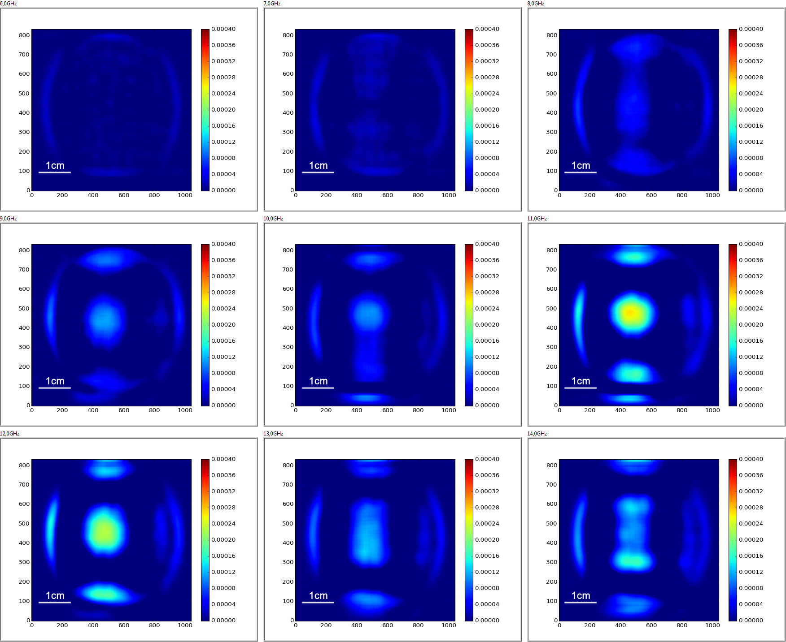
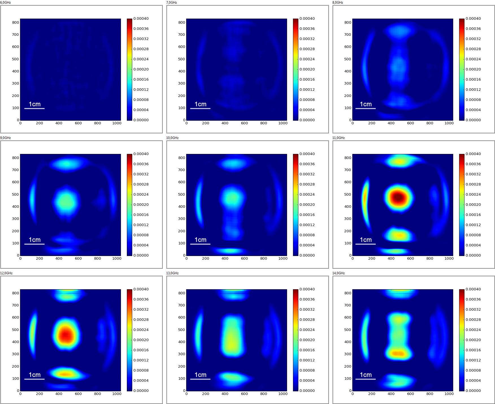
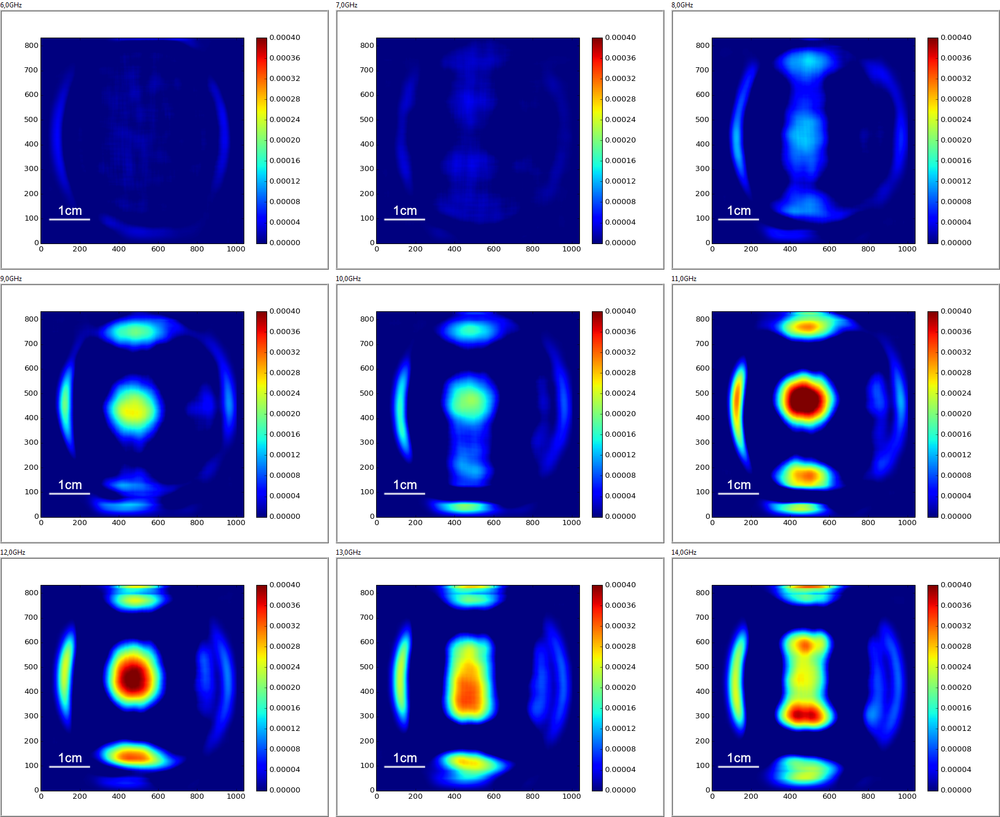
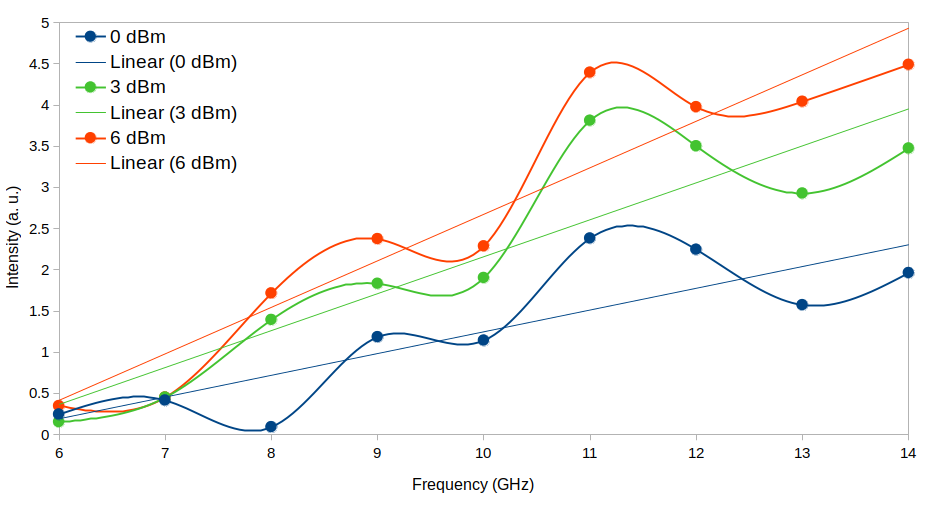

## ՋԱՕԻՄ֊ով ալիքատարի ճառագայթված էլեկտրամագնիսական ալիքների հետազոտում

ՋԱՕԻՄ֊ով հետազոտվեց ուղղանկյուն ալիքատարից ճառագայթված էլեկտրամագնիսական
ալիքները։ Չափվում էր էլեկտրամագնիսական դաշտի մագնիսական բաղադրիչը։ Ալիքատարը
տեղադրված էր ապակուց 5մմ հեռավորության վրա։ Ալիքատարը աշխատեցվեց 0, 3 և 6 dBM
հզորություններով։ Ամեն հզորությամբ աշխատեցնելիս ալիքի՝ [6, 14] ԳՀց միջակայքում,
1ԳՀց քայլով ամեն ինը հաճախության համար չափվել է ալիքատարի մագնիսական դաշտի
ինտենսիվությունը։ Ստորև բերված են ամեն հզորության համար չափված մագնիսական դաշտի
ինտենսիվությունների դաշտերը՝ ամեն հաճախության ալիքի համար։

*0dBm հզորությամբ աշխատած ալիքատարի մագնիսական դաշտի չափումները*

*3dBm հզորությամբ աշխատած ալիքատարի մագնիսական դաշտի չափումները*

*6dBm հզորությամբ աշխատած ալիքատարի մագնիսական դաշտի չափումները*

Ստորև բերված գրաֆիկում ցույց է տրված վերը նշված հզորություններում մագնիսական
դաշտի հիմնական կենտրոնական մասի միջին ինտենսիվության կախումը [6, 14] ԳՀց
միջակայքում հաճախությունից։ Ամեն հզորության գրաֆիկի համար նաև ցույց է տրված նրա
գծային մոտարկումը։

Փորձը ցույց տվեց, որ մագնիսական դաշտի ինտենսիվությունը հաճախությունից կախված
աճում է գծայինին մոտ օրենքով։

